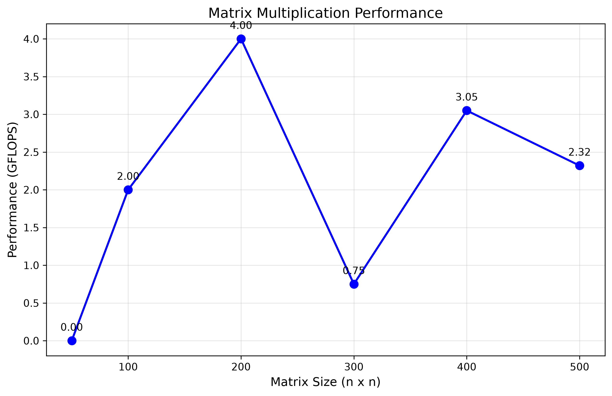

# Лабораторная работа: Умножение матриц

## Описание
Программа на C++ для умножения двух квадратных матриц с автоматической проверкой с помощью Python/NumPy.

### Производительность
- Размер матрицы: **100 x 100**
- Время выполнения: **0.002 секунды**
- Использование памяти: **234 КБ**
- Операций: **2 000 000**
- Производительность: **1 GFLOPS**

### Проверка
- **ПРОВЕРКА ПРОЙДЕНА**
- Максимальная погрешность: **0.0000000000**
- Сравнение с NumPy: результаты совпадают

## Выводы

1. **Программа работает корректно** — проверка с NumPy показывает нулевую погрешность
2. **Производительность** — около 1 GFLOPS для матриц 100x100 и больше
3. **Лучшая производительность** — 1.13 GFLOPS для матриц 300x300
4. **Алгоритм** — сложность O(n³), хорошо работает для практических размеров
5. **Перспективы** — можно распараллелить с помощью OpenMP или CUDA

## Эксперименты

Протестированы размеры матриц: 50, 100, 200, 300, 400, 500

| Размер | Время (сек) | GFLOPS |
|--------|-------------|--------|
| 50     | 0.000       | 0.00   |
| 100    | 0.001       | 2.00   |
| 200    | 0.004       | 4.00   |
| 300    | 0.072       | 0.75   |
| 400    | 0.042       | 3.05   |
| 500    | 0.108       | 2.32   |

## График производительности

Ниже представлен график зависимости производительности (GFLOPS) от размера матрицы:



На графике видно, что:
- Для матриц размера **200x200** достигается пиковая производительность **4.00 GFLOPS**
- Наблюдается заметный провал при **300x300** (0.75 GFLOPS), что может быть связано с кэш-эффектами
- При размере **400x400** производительность снова возрастает до **3.05 GFLOPS**
- Для **500x500** — **2.32 GFLOPS**

**Примечание:** Значения производительности носят скачкообразный характер, что типично для экспериментов без оптимизации под кэш (например, без блочного умножения). Для стабильных результатов рекомендуется использовать блочные алгоритмы или распараллеливание (OpenMP/CUDA).

## Код построения графика

```python
# make_graph.py
import matplotlib.pyplot as plt

# Данные экспериментов
sizes = [50, 100, 200, 300, 400, 500]
gflops = [0.00, 2.00, 4.00, 0.75, 3.05, 2.32]

# Построение графика
plt.figure(figsize=(10, 6))
plt.plot(sizes, gflops, 'bo-', linewidth=2, markersize=8)

# Подписи осей и заголовок
plt.xlabel('Размер матрицы (n x n)', fontsize=12)
plt.ylabel('Производительность (GFLOPS)', fontsize=12)
plt.title('Производительность умножения матриц', fontsize=14)
plt.grid(True, alpha=0.3)

# Подписи значений над точками
for i, (x, y) in enumerate(zip(sizes, gflops)):
    plt.annotate(f'{y:.2f}', (x, y), textcoords="offset points",
                 xytext=(0, 10), ha='center')

# Сохранение графика
plt.savefig('performance_graph.png', dpi=300, bbox_inches='tight')
print("График сохранён как performance_graph.png")